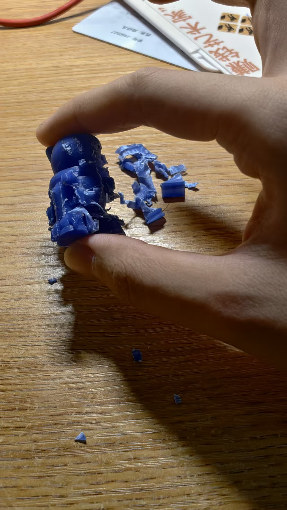
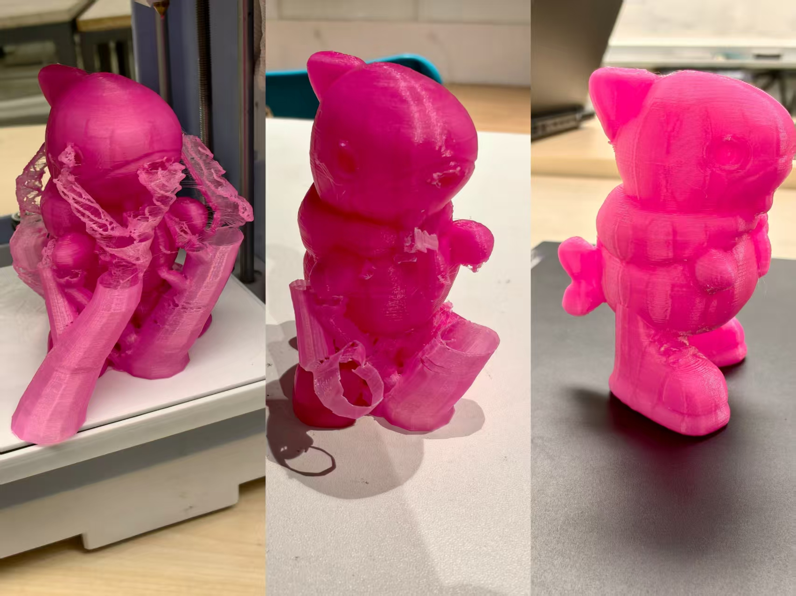
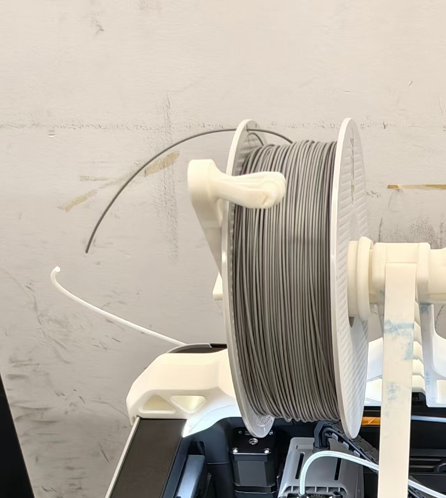

# HTAM--Zhou-yifan-2025
MY PERSONAL DOCUMENTATION OF THE COURSE [HOW THINGS ARE MADE] IN TONGJI

# 3D SCANNING EXPERIMENT(S)

## Preliminary experiment
### DATE：2025-9-17
In the HTAM class, we attempted to use Revo for scanning the cucumbers and the iPad's camera to do face scanning. The point cloud scanning by Revo was relatively fine, but some displacements occurred during the experiments in class; the iPad camera's scanning accuracy was not high and it was prone to deviation, but when used in the coarse model state, it had achieved a relatively satisfactory result.

image during classes, scanning hulu

image during classes, Saverio doing face-scanning

## SOFTWARE & EQUIPMENTS USED
I went to the fablab and used the Revo scanner. The accompanying software was installed on my laptop. The object I scanned was this grey plush little shark. (I wasn't sure about the reflection on the plush surface, so I was quite worried that something might go wrong during the scanning process.)

an image of the scanned object

## SCANNING PROCESS
### DATE：2025-9-19
#### GOAL
·Using the handheld scanner from Revo to perform the scan. I prefer the level of detail achieved by the scanner, so I went to the fablab.

#### PROCESS
First, I attempted to use the manual turntable instead of the automatic one (actually because I didn't know how to connect the automatic turntable... ) However, the model has many flaws and misalignments.

an image of USING THE MANUAL TURNTABLE

Saverio told us that the white dots on the automatic turntable are used to position the scanner. Therefore, compared to handheld scanning and manual turntable scanning, using the automatic turntable will result in higher accuracy.
At first, I tried to complete the part that couldn't be scanned by simply holding up the shark and placing the bottom surface directly in front of the scanner. However, this would cause the scanner to lose its positioning.Then, we changed the position of the small shark and conducted a second scan - this was because in a single scan, certain parts might be missed due to the placement angle, although the turntable had rotated 360 degrees; multiple scans could complete the scanning of the entire object and obtain multiple different 3D models. By combining the two models from different angles, we finally obtained a scanning model with fewer flaws.

the bottom of the shark

scanning from another position

#### RESULT
After obtaining the individual model, I used the mesh construction feature in Revo to convert the point cloud into a mesh and then merged them. Thus, I obtained a rough shark scanning model - but due to the surface material, there were many bumpy and uneven marks on it, along with some small holes and unnecessary overlapping parts - I need to deal with these issues.

YOU CAN SEE SOME OVERLAPPING PARTS HERE 

The imported model after being loaded into Blender

---

## REMIXING PROCESS

### DATE：2025-9-23
#### PRETREATMENT
After completing the smoothing of the model's surface, I was still not satisfied with its quality. Therefore, I used Blender's sculpting mode to further process it, making it more like a hard-surface toy model. I smoothed out the facial features of the shark and re-carved them. 

shark, with its face removed

pretreated model

#### REMIXING
To make some alterations to the original model, I have considered several ways to redesign the shark. I plan to add some new clothes or accessories to it to bring about a slight change in its appearance.
Then I came up with a meme.

Exactly this one - these kind of ai creatures once filled my online platform life, i could see them everywhere - i have completely no idea why:)
So I decided to give this tiny little shark... A pair of shoes. Sport shoes, perhaps nike or anta.

And here comes the shoe!

#### RESULT
I made this in blender.I referred to a shoe modeling tutorial on Bilibili. However, since the final purpose of using the model in this tutorial was not 3D printing, some of the surfaces were not properly closed, and a hollow structure was also designed - therefore, I made some adjustments to it. You can view the bilibili tutorial here: 【blender：鞋子建模-哔哩哔哩】 https://b23.tv/UOIQoTd
and when it was assembled onto the shark, it looks like this:

I exported it in stl file type and, it was finally ready to be printed...Maybe.

---

# 3D PRINTING EXPERIMENT(S)

## Preliminary experiment
### DATE：2025-9-23
Similarly, in the classroom, under the guidance of the teacher, we completed the 3D printing process using a desktop 3D printer and the Ultimaker Cura software for slicing data export. During this process, we set the layer height, used the brim setting, adjusted the model size, and modified the print edge thickness. We printed a 2cm*2cm*2cm cube through the desktop printer:

The printer we used - a quite simple one

To test it, we printed this through the printer. I The only problem is that I mistakenly added a brim to this object - it has a flat bottom, so in fact this step is not necessary - so when removing this cube, the excess brim becomes very difficult to clean.

## My FIRST TRY - FAILED
### DATE：2025-9-24
I set up the slicing for the model of the little shark wearing shoes in Cura, added support, and proceeded with the printing. The printer worked very smoothly - I envisioned printing a mini version as a test model first, and then a larger final version.

The printer worked smoothly.

Here is the printed object

Although this model is just a mini test version, I still think it is not a success.I fought with the support of this model for twenty minutes. Eventually, I had to admit that I simply couldn't remove it from the model surface without causing any damage to the model.

CHECK THIS FAILED OBJECT. THERE ARE TWO MAIN PROBLEMS:
1. THE SIZE IS TOOOO SMALL: When I went to the fablab, it was already 4:40. So I had only at most 20 minutes to finish the whole printing - I thought I could do a smaller one at first to make sure if there was anything going wrong with my model. So I did one witch was only 4mm in height.
2. THE SUPPORT IS...TO BE HONEST, IT'S LIKE A PRISON: When setting up the model's support, I did not choose the tree-like option. At the same time, I set the contact area to "everywhere" and did not change the contact distance between the support top and the model - this resulted in it becoming extremely sturdy, dense, and difficult to disassemble.

I WILL TRY ANOTHER BIGGER ONE TOMORROW.

## My SECOND TRY 
### DATE：2025-9-26/27

This model was also made with a simple desktop printer. I changed the form of the support and used a tree-like support. It is about 8.5 cm tall. The support is a bit easier to remove than the first version, but it is still very rough. I spent two hours removing the support with a file and scissors, but there are still many particles and uneven parts remaining on the contact surface. It looks like a little shark wearing an underwear...

The biggest problem this model faces is that the printer's working quality makes it hard to fully display all the details. I'm worried that the insufficient setting of the tilt angle will cause collapse during printing, so the support is still very dense and extremely difficult to disassemble. I'm planning to sand this model first and then try to find a higher-quality printer.
8

## HERE COMES THE SAVIOR...MY THIRD TRY
### DATE：2025-9-28
This Sunday, I attended the 3D Printing Shoe Design Workshop at WDCC, a collaborative project between bambu lab and our college. A bambu staff member demonstrated how to operate their state-of-the-art H2D printer—— which is five to six times larger than the model we used in class! The printer employs bambu studio software for slicing and support settings, similar to the operation interface of Cura software. In the morning, while other workshop participants were working on shoe upper material testing, I used the printer with PLA gray material to create my own shark model.

H2D printers

My setup was 0.4 nozzle, 0.2 height, 15% density, square inside, 0.8mm wall thickness, tree support, and I took a second to remove all the supports after printing...

Material used

While printing

Comparison

Meanwhile, the bambu lab also offers TPU material. This relatively soft material requires a 0.6mm nozzle for the 85A model, so I spent considerable time replacing nozzles for users who came to print. In the end, I attempted to use the 85A model to print a small shark. However, since the materials weren't properly dried, the finished product developed some stringing.
So here's the final products------

## FINAL

From left to right are the original shark, the shark printed by the desktop printer, the bambu PLA shark and the bambu TPU shark.

THANKS FOR WATCHING

